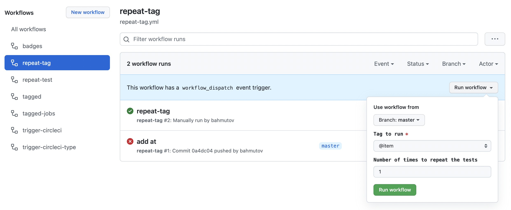
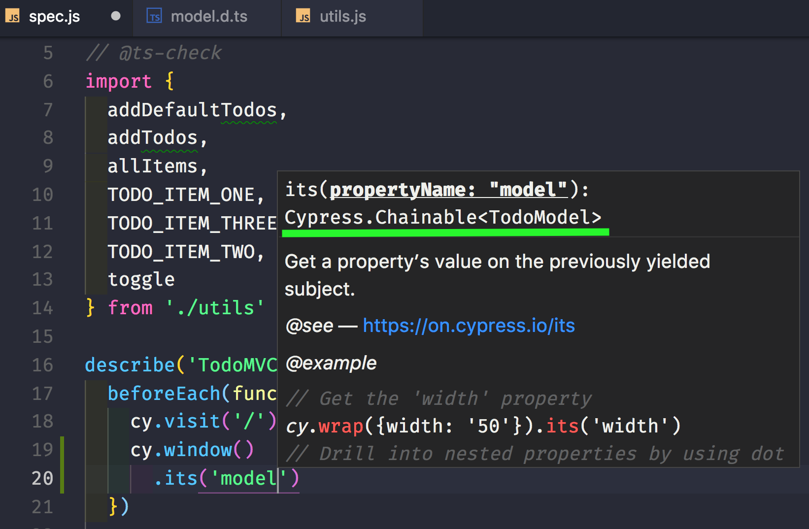
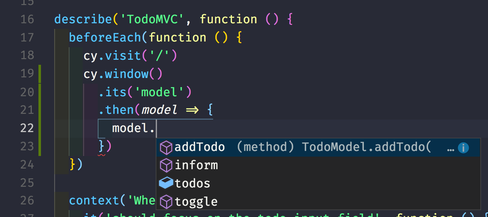

# test-todomvc-using-app-actions

[![Build status][ci-image]][ci-url] [![renovate-app badge][renovate-badge]][renovate-app] [](https://dashboard.cypress.io/projects/ovmwmi/runs) [](https://github.com/bahmutov/test-todomvc-using-app-actions/actions/workflows/ci.yml) [](https://github.com/bahmutov/test-todomvc-using-app-actions/actions/workflows/spec-dependencies.yml)

  

> Example Cypress tests going from page objects to app actions

This repo was used as an example in these blog posts:

- [Stop using Page Objects and Start using App Actions](https://www.cypress.io/blog/2019/01/03/stop-using-page-objects-and-start-using-app-actions/)
- [Convert Cypress Specs from JavaScript to TypeScript](https://glebbahmutov.com/blog/cypress-js-to-ts/).
- [Run Just The Failed Tests In Cypress](https://glebbahmutov.com/blog/run-failed-tests/)

## Steps

Each step is a Git tag. You can check out particular tag, install dependencies and run application and tests. Usually it would be:

```shell
git checkout <tag>
npm install
npm start
# from another terminal
npm run cypress
```

1. `00-start` just TodoMVC application running at `localhost:8888`
2. `01-first-test` adds Cypress and first end-to-end test in [spec.js](cypress/integration/spec.js)
3. `02-tests` brings a lot of tests from [cypress-example-todomvc](https://github.com/cypress-io/cypress-example-todomvc) to [spec.js](cypress/integration/spec.js). All tests work through UI (page), sometimes using custom commands defined in [cypress/support/commands.js](cypress/support/commands.js)
4. `03-page-object` drives app via page object [todo.page.js](cypress/integration/todo.page.js)
5. `04-app-actions` controls application by mostly directly calling the [model instance](js/todoModel.js) directly to avoid always going through the page.
6. `05-types` adds TypeScript [model interface](cypress/integration/model.d.ts) so our tests know the app actions [they can trigger](cypress/integration/utils.js)
7. `06-split` splits all tests into multiple spec files.
8. `07-grep` added tags and the [@bahmutov/cy-grep](https://github.com/bahmutov/cy-grep) plugin.
9. `08-tags` tags the features and creates the ways to run CircleCI and GitHub Actions by selecting the tags to run.
10. `09-regression` tags some tests as `@regression` and updates the CI workflows.
11. `10-typescript` shows all specs written in TypeScript and passing the static types check.
12. `11-config-ts` moves `cypress.config.js` to TypeScript

## Tests

All tests are in folder [cypress/integration](cypress/integration). Common test settings are in [cypress.json](cypress.json) file.

## Workflows

This repo shows how to use manual workflows to select the tests to run.



- [repeat-test.yml](./.github/workflows/repeat-test.yml) lets you run a test N times by entering part of the test's title
- [repeat-tag.yml](./.github/workflows/repeat-tag.yml) lets you run all tests tagged with specific tag
- [repeat-spec.yml](./.github/workflows/repeat-spec.yml) lets you repeat the same spec multiple times

## Blog posts

- [Stop using Page Objects and Start using App Actions](https://www.cypress.io/blog/2019/01/03/stop-using-page-objects-and-start-using-app-actions/)
- [How To Tag And Run End-to-End Tests](https://glebbahmutov.com/blog/tag-tests/)
- [Convert Cypress Specs from JavaScript to TypeScript](https://glebbahmutov.com/blog/cypress-js-to-ts/)

## IntelliSense

In the application code [js/app.jsx](js/app.jsx) we set `window.model = ...` to expose our model instance for app actions to work. If we use TypeScript check via `// @ts-check` directive, we need to "tell" TS compiler that there is a new property `model` on the global `window` object. We can do this by writing file [cypress/integration/model.d.ts](cypress/integration/model.d.ts) with interface definition for `TodoModel` and `window` update. Something like this

```ts
interface TodoModel {
  todos: unknown[]
  addTodo(...todos: string[])
  // more methods
}
// During tests there we set "window.model" property
// now cy.window() returns Window instance with
// the "model" property that has TodoModel interface
interface Window {
  model: TodoModel
}
```

From our JavaScript spec files, we need to load this `model.d.ts` file, and we can do this using special `/// <reference>` comment.

```js
// type definitions for Cypress object "cy"
/// <reference types="cypress" />
// type definition for out TodoModel
/// <reference path='./model.d.ts' />
// @ts-check
```

Now whenever you use `cy.window().its('model')` command, IntelliSense will correctly suggest the "model" property.



And you can invoke the right methods on the `window.model`



Read more about [intelligent code completion in Cypress](https://on.cypress.io/intelligent-code-completion).

## Spec dependencies

Using [spec-change](https://github.com/bahmutov/spec-change) utility we update the dependencies between the Cypress spec files and save them into [deps.json](./deps.json). See the [spec-dependencies workflow](./.github/workflows/spec-dependencies.yml)

[renovate-badge]: https://img.shields.io/badge/renovate-app-blue.svg
[renovate-app]: https://renovateapp.com/
[ci-image]: https://circleci.com/gh/bahmutov/test-todomvc-using-app-actions.svg?style=svg
[ci-url]: https://circleci.com/gh/bahmutov/test-todomvc-using-app-actions

## Small print

Author: Gleb Bahmutov &lt;gleb.bahmutov@gmail.com&gt; &copy; 2022

- [@bahmutov](https://twitter.com/bahmutov)
- [glebbahmutov.com](https://glebbahmutov.com)
- [blog](https://glebbahmutov.com/blog)
- [videos](https://www.youtube.com/glebbahmutov)
- [presentations](https://slides.com/bahmutov)
- [cypress.tips](https://cypress.tips)
- [Cypress Tips & Tricks Newsletter](https://cypresstips.substack.com/)
- [my Cypress courses](https://cypress.tips/courses)

License: MIT - do anything with the code, but don't blame me if it does not work.

Support: if you find any problems with this module, email / tweet /
[open issue](https://github.com/bahmutov/test-todomvc-using-app-actions/issues) on Github

## MIT License

Copyright (c) 2022 Gleb Bahmutov &lt;gleb.bahmutov@gmail.com&gt;

Permission is hereby granted, free of charge, to any person
obtaining a copy of this software and associated documentation
files (the "Software"), to deal in the Software without
restriction, including without limitation the rights to use,
copy, modify, merge, publish, distribute, sublicense, and/or sell
copies of the Software, and to permit persons to whom the
Software is furnished to do so, subject to the following
conditions:

The above copyright notice and this permission notice shall be
included in all copies or substantial portions of the Software.

THE SOFTWARE IS PROVIDED "AS IS", WITHOUT WARRANTY OF ANY KIND,
EXPRESS OR IMPLIED, INCLUDING BUT NOT LIMITED TO THE WARRANTIES
OF MERCHANTABILITY, FITNESS FOR A PARTICULAR PURPOSE AND
NONINFRINGEMENT. IN NO EVENT SHALL THE AUTHORS OR COPYRIGHT
HOLDERS BE LIABLE FOR ANY CLAIM, DAMAGES OR OTHER LIABILITY,
WHETHER IN AN ACTION OF CONTRACT, TORT OR OTHERWISE, ARISING
FROM, OUT OF OR IN CONNECTION WITH THE SOFTWARE OR THE USE OR
OTHER DEALINGS IN THE SOFTWARE.
